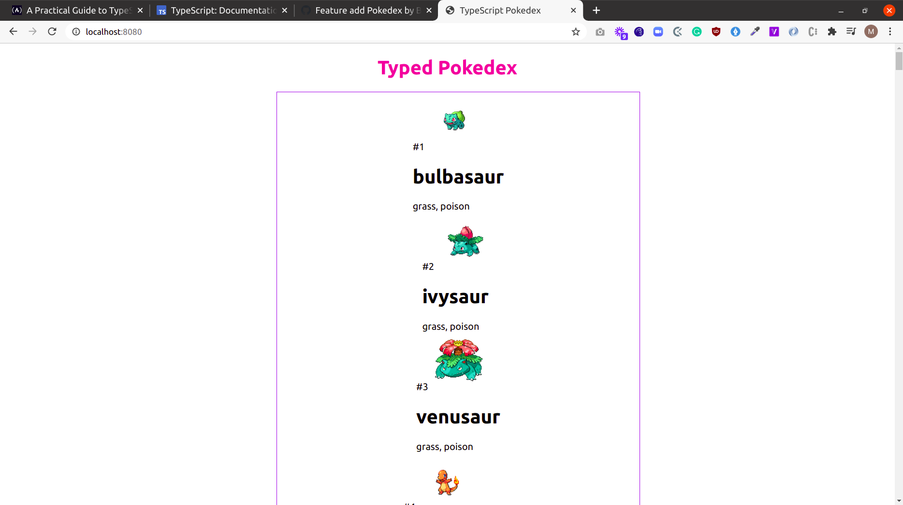

### Pokedex
A Typescript example project - coded for learning purposes.

## Built With

- TypeScript
- Express server
- Nodejs

[Deployed site](https://bluette1.github.io/Pokedex/)

#### Description

A TypeScript example prject - coded for learning purposes by following this [tutorial](https://www.freecodecamp.org/news/a-practical-guide-to-typescript-how-to-build-a-pokedex-app-using-html-css-and-typescript/).

## Install typescript globally
  - Type the following command in the terminal
  `npm install -g typescript`

## Compiling a *.js file to a *.ts file
 - Inside the root directory of the project run
  `tsc`
  
## Run server

`yarn install && node server.js`

## Authors

👤 **Marylene Sawyer**
- Github: [@Bluette1](https://github.com/Bluette1)
- Twitter: [@MaryleneSawyer](https://twitter.com/MaryleneSawyer)
- Linkedin: [Marylene Sawyer](https://www.linkedin.com/in/marylene-sawyer-b4ba1295/)

# Acknowledgements

- The content in this repository was retrieved from or inspired by the following sites
  - [A Practical Guide to TypeScript - How to Build a Pokedex App Using HTML, CSS, and TypeScript](https://www.freecodecamp.org/news/a-practical-guide-to-typescript-how-to-build-a-pokedex-app-using-html-css-and-typescript/)

## 🤝 Contributing

Contributions, issues and feature requests are welcome!
